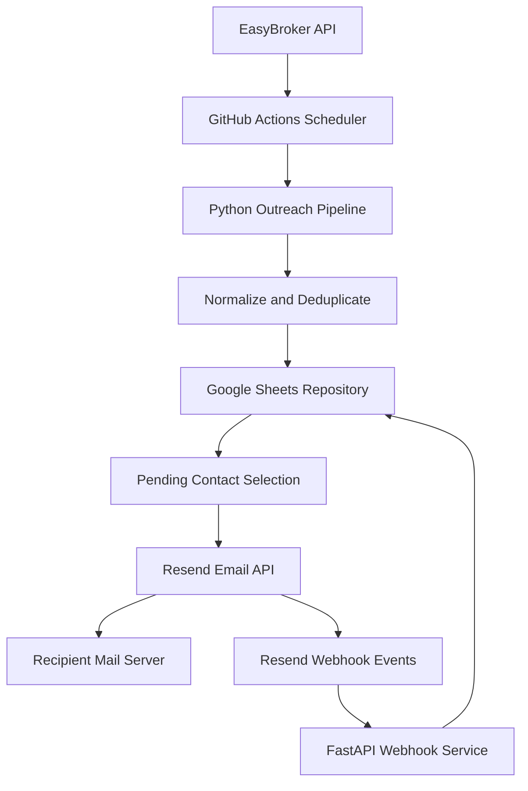

# Event-Driven Outreach Automation Platform

Python portfolio project that automates a low-volume outbound workflow around EasyBroker, Google Sheets, Resend, FastAPI, Railway, and GitHub Actions.

## What problem it solves

When outbound contacts are created during the day inside a CRM, follow-up often depends on manual exports, manual deduplication, and inconsistent email tracking. This project turns that into a scheduled, event-driven workflow with a pragmatic operator-friendly datastore.

## Architecture



## Execution flow

1. GitHub Actions triggers the pipeline on a daily schedule or manually.
2. The pipeline fetches recent contacts from EasyBroker.
3. Contacts are normalized into typed models and deduplicated by `external_id`.
4. New contacts are stored in Google Sheets.
5. Pending contacts are marked as `processing` before delivery.
6. Resend sends emails with configurable throttling and sender rotation across configured identities.
7. Successful sends persist the provider message id.
8. Resend webhook events update delivery, open, and bounce states idempotently.

## Stack

- Python 3.11
- FastAPI
- Pydantic + `pydantic-settings`
- Requests
- GSpread + Google service account auth
- Resend
- Pytest
- Ruff
- uv
- GitHub Actions
- Railway

## Repository structure

```text
.
├── src/outreach_system/
│   ├── api/
│   ├── integrations/
│   ├── models/
│   ├── services/
│   ├── cli.py
│   ├── config.py
│   ├── exceptions.py
│   ├── logging_config.py
│   └── main.py
├── tests/
│   ├── integration/
│   └── unit/
├── .github/workflows/
├── .env.example
├── Procfile
├── README.md
├── SECURITY.md
└── pyproject.toml
```

## Installation

```bash
uv sync
```

## Configuration

1. Copy `.env.example` to `.env`.
2. Fill in runtime secrets locally.
3. Mirror those values into GitHub Actions secrets and Railway environment variables.

Important variables:

- `EASYBROKER_API_KEY`
- `GOOGLE_SERVICE_ACCOUNT_JSON`
- `GOOGLE_SPREADSHEET_ID`
- `RESEND_API_KEY`
- `RESEND_FROM_EMAILS`
- `RESEND_WEBHOOK_SECRET`
- `OUTREACH_TIMEZONE`
- `EMAIL_DELAY_MIN_SECONDS`
- `EMAIL_DELAY_MAX_SECONDS`

## Local usage

Run the pipeline:

```bash
uv run python -m outreach_system.cli --run-now
uv run python -m outreach_system.cli --run-now --max-emails 20
```

Run the webhook service locally:

```bash
uv run uvicorn webhook_server:app --host 0.0.0.0 --port 8080
```

Health check:

```bash
curl http://localhost:8080/health
```

## Tests

```bash
uv run ruff check .
uv run pytest
```

## Deployment

- GitHub Actions runs the sync + outreach pipeline.
- Railway runs the FastAPI webhook service using `Procfile`.
- The webhook endpoint is `POST /webhooks/resend`.

## Technical decisions

- Google Sheets is used as a pragmatic low-volume operator-facing datastore.
- Typed Pydantic models replace arbitrary dictionaries for the core workflow.
- `processing` state plus provider message ids improve idempotence within the limits of Sheets.
- Webhook events are deduplicated using Svix event ids stored in a dedicated worksheet.

## Limitations and trade-offs

- Google Sheets offers accessibility and immediate visibility for non-technical users, but it is not transactional storage.
- At larger volume, PostgreSQL should become the system of record.
- A queue such as Redis, SQS, or Pub/Sub would be the next step to separate ingestion from email delivery.
- The current email content is intentionally static because the refactor preserved the existing business behavior.

Future target architecture:

```text
Scheduler
  → CRM Sync
  → PostgreSQL
  → Queue
  → Email Worker
  → Resend
  → Webhook
  → PostgreSQL
  → Reporting
```

## Security and privacy

- Do not commit `.env` files or service account JSON files.
- Rotate any credential previously used during private development before publishing.
- Avoid logging API keys, full email addresses, phone numbers, or full webhook payloads.
- See [SECURITY.md](SECURITY.md) for rotation and history-cleanup guidance.
